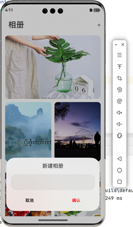

# 电子相册

### 简介

基于ArkTS实现一个电子相册的案例，通过捏合和拖拽手势控制图片的放大、缩小、左右拖动查看细节等效果。

### 相关概念

- Swiper：滑块视图容器，提供子组件滑动轮播显示的能力。
- Grid：网格容器，由“行”和“列”分割的单元格所组成，通过指定“项目”所在的单元格做出各种各样的布局。
- Navigation：Navigation组件一般作为Page页面的根容器，通过属性设置来展示页面的标题、工具栏、菜单。
- List：列表包含一系列相同宽度的列表项。适合连续、多行呈现同类数据，例如图片和文本。
- 组合手势：手势识别组，多种手势组合为复合手势，支持连续识别、并行识别和互斥识别。
- 自定义弹窗
- 动画效果

### 相关权限

不涉及

### 使用说明

1. 用户可以使用捏合手势实现图片的放大缩小。
2. 用户可以通过滑动手势实现图片的左右切换。
3. 用户可以在图片放大的基础上，可以通过拖拽手势对图片进行拖拽查看细节。
4. 长按主页相册可拖动。
5. 新建相册（随机）。
6. 轮播图隐藏和显示

### 约束与限制

1. 本示例仅支持标准系统上运行，支持设备：华为手机。
2. HarmonyOS系统：HarmonyOS NEXT Developer Beta1及以上。
3. DevEco Studio版本：DevEco Studio NEXT Developer Beta1及以上。
4. HarmonyOS SDK版本：HarmonyOS NEXT Developer Beta1 SDK及以上。

### 代码结构

~~~
├──entry/src/main/ets
│  ├─common
│  │  ├─constants
│  │  │    └─Constants.ets               // 公共常量
│  │  ├─modules
│  │  │    ├─AttributeModifier.ets       // 动态属性
│  │  │    └─GridItemDeletionCtrl.ets    // 动画类
│  │  └─utils
│  │       ├─Logger.ets                  // 日志类
│  │       └─permission.ets              // 权限类
│  ├─components
│  │  ├─CustomDialog.ets                 // 自定义弹窗类
│  │  └─IconButton.ets                   // 自定义按钮类
│  ├─entryability
│  │  └─EntryAbility.ets                 // 程序入口
│  ├─pages
│  │  ├─DetailListPage.ets               // 相册列表页2
│  │  ├─DetailPage.ets                   // 图片详情页
│  │  ├─IndexPage.ets                    // 主页
│  │  └─ListPage.ets                     // 相册列表页1
│  └─view
│     └─PhotoItem.ets                    // 相册组件
└──entry/src/main/resources              // 资源文件夹
~~~

### 更新

1.菜单和自定义弹窗

自定义弹窗
~~~ typescript
build() {
    Column() {
      Text('新建相册')
        .fontSize(20)
        .margin(20)
      TextInput({ placeholder: '', text: this.textValue }).height(60).width('90%')
        .onChange((value: string) => {
          this.textValue = value
        })
      Flex({
        justifyContent: FlexAlign.SpaceAround
      }) {
        Button('取消')
          .backgroundColor('#00000000')
          .fontColor(Color.Black)
          .onClick(() => {
            this.controller.close()
            this.cancel()
          })
        Button('确认')
          .backgroundColor('#00000000')
          .fontColor(Color.Red)
          .onClick(() => {
            this.controller.close()
            this.confirm()
          })
      }
      .margin({
        bottom:20,
        top:20
      })
    }
  }
~~~

2.申请权限和消息提示

3. 背景随轮播图切换

~~~ typescript
// 初始化页面获取第一张图片的颜色
const context = getContext(this);
const resourceMgr: resourceManager.ResourceManager = context.resourceManager;
const fileData: Uint8Array = await resourceMgr.getMediaContent(Constants.BANNER_IMG_LIST[0]);
const buffer = fileData.buffer as ArrayBuffer;
const imageSource: image.ImageSource = image.createImageSource(buffer);
const pixelMap: image.PixelMap = await imageSource.createPixelMap();

// 智能取色器接口使用，初始化背景色
effectKit.createColorPicker(pixelMap, (err, colorPicker) => {
  let color = colorPicker.getMainColorSync();
  // 将取色器选取的color示例转换为十六进制颜色代码
  this.bgColor = "#" + color.alpha.toString(16) + color.red.toString(16) + color.green.toString(16) + color.blue.toString(16)
})
~~~
swiper组件添加
~~~ typescript
.onAnimationStart(async (index, targetIndex) => {
        try {
          const context = getContext(this);
          // 获取resourceManager资源管理器
          const resourceMgr: resourceManager.ResourceManager = context.resourceManager;
          const fileData: Uint8Array = await resourceMgr.getMediaContent(Constants.BANNER_IMG_LIST[targetIndex]);
          // 获取图片的ArrayBuffer
          const buffer = fileData.buffer as ArrayBuffer;
          // 创建imageSource
          const imageSource: image.ImageSource = image.createImageSource(buffer);
          // 创建pixeMap
          const pixelMap: image.PixelMap = await imageSource.createPixelMap();

          effectKit.createColorPicker(pixelMap, (err, colorPicker) => {
            // 读取图像主色的颜色值，结果写入Color
            let color = colorPicker.getMainColorSync();
            // 开启背景颜色渲染的属性动画
            animateTo({ duration: 500, curve: Curve.Linear, iterations: 1 }, () => {
              // 将取色器选取的color示例转换为十六进制颜色代码
              this.bgColor = "#" + color.alpha.toString(16) + color.red.toString(16) + color.green.toString(16) + color.blue.toString(16);
            })
          })
        } catch (e) {
        }
~~~
column组件
~~~ typescript
.linearGradient({
      // 渐变方向
      direction: GradientDirection.Bottom,
      // 数组末尾元素占比小于1时，满足重复着色的效果
      colors: [[this.bgColor, 0.0], [Color.White, 0.5]]
    })
~~~

4.组件拖动动画

动画类
~~~ typescript
import { GridItemModifier } from './AttributeModifier';

const ANIMATION_DURATION: number = 200; // 动画总时长200ms
const GRID_ITEM_HEIGHT: number = 72; // gridItem的高度
const COLUMN_COUNT: number = 5; // 列数

enum DeletionStatus {
  IDLE,
  START,
  FINISH
}

/**
 * gridItem删除管理
 */
export class GridItemDeletionCtrl<T> {
  private modifier: GridItemModifier[] = [];
  private gridData: T[] = [];
  private status: DeletionStatus = DeletionStatus.IDLE;

  constructor(data: T[]) {
    this.gridData = data;
    data.forEach(() => {
      this.modifier.push(new GridItemModifier());
    })
  }

  /**
   * 获取当前gridItem的modifier
   * @param item 网格元素
   * @returns 属性对象
   */
  getModifier(item: T): GridItemModifier {
    const index: number = this.gridData.indexOf(item);
    if (index === -1) {
      return new GridItemModifier();
    } else {
      return this.modifier[index];
    }
  }

  /**
   * 删除gridItem
   * @param item 网格元素
   * @param itemAreaWidth 网格区域宽度
   */
  deleteGridItem(item: T, itemAreaWidth: number): void {
    const index: number = this.gridData.indexOf(item);
    // 最后一条数据不执行偏移
    if (index === this.gridData.length - 1) {
      this.gridData.splice(index, 1);
      this.modifier.splice(index, 1);
      return;
    }
    // TODO:知识点:实现删除动画。先让目标元素的opacity为0，不可视，直接删除目标元素会导致偏移的时候位置异常，接着遍历元素的属性对象，修改偏移量。
    this.modifier[index].opacity = 0;
    animateTo({
      curve: Curve.Friction, duration: ANIMATION_DURATION, onFinish: () => {
        // 初始化偏移位置
        this.modifier.forEach((item) => {
          item.offsetX = 0;
          item.offsetY = 0;
        })
        // 删除对应的数据
        this.gridData.splice(index, 1);
        this.modifier.splice(index, 1);
        this.status = DeletionStatus.FINISH;
      }
    }, () => {
      this.modifier.forEach((item: GridItemModifier, ind: number) => {
        if (ind > index && ind % COLUMN_COUNT !== 0) {
          item.offsetX = -itemAreaWidth;
        } else if (ind > index && ind % COLUMN_COUNT === 0) {
          item.offsetX = itemAreaWidth * 4; // 位置偏移到上一行的最后一列，因此偏移4个gridItem所占的宽度
          item.offsetY = -GRID_ITEM_HEIGHT;
        }
      })
      this.status = DeletionStatus.START;
    })
  }
}
~~~
~~~ typescript
/**
* 应用被添加到首页应用所展示的动画
*/
private effect: TransitionEffect =
TransitionEffect.OPACITY.animation({
  curve: curves.springMotion(0.6, 0.8)
})
  // 通过combine方法,这里的动画参数会跟随上面的TransitionEffect，也就是springMotion(0.6, 0.8)
  .combine(TransitionEffect.scale({
    x: 0,
    y: 0
  }))
    // 添加旋转转场效果，这里的动画参数会跟随上面带animation的TransitionEffect，也就是springMotion(0.6, 0.8)
  .combine(TransitionEffect.rotate({ angle: 0 }))
    // 添加平移转场效果，这里的动画参数使用指定的springMotion()
  .combine(TransitionEffect.translate({ x: 150 })
    .animation({ curve: curves.springMotion() }))
    // 添加move转场效果，这里的动画参数会跟随上面的TransitionEffect，也就是springMotion()
  .combine(TransitionEffect.move(TransitionEdge.END))
~~~
grid组件
~~~ typescript
.editMode(true)
.onItemDragStart((event: ItemDragInfo, itemIndex: number) => {
// 在onItemDragStart函数返回自定义组件，可在拖拽过程中显示此自定义组件。
return this.pixelMapBuilder();
})
.onItemDrop((event: ItemDragInfo, itemIndex: number, insertIndex: number, isSuccess: boolean) => {
// 执行gridItem切换操作
if (isSuccess && insertIndex < this.appInfoList.length) {
  this.changeIndex(itemIndex, insertIndex);

}
~~~

5.轮播图的隐藏和显示

~~~ typescript
.bindMenu([
            {
              value: '新建相册',
              action: () => {
                this.dialogController.open()
              }
            },
            {
              value: this.set,
              action: () => {
                if (this.set == '隐藏轮播'){
                  this.visib = Visibility.None
                  this.set = '显示轮播'
                }else{
                  this.visib = Visibility.Visible
                  this.set = '隐藏轮播'
                }
              }
            },
          ])
~~~

6.新建相册功能实现和动画效果

### 参考资料

1. https://developer.huawei.com/consumer/cn/doc/harmonyos-references-V2/ts-universal-attributes-menu-0000001478181385-V2
2. https://developer.huawei.com/consumer/cn/doc/harmonyos-guides-V5/request-user-authorization-V5
3. https://gitee.com/harmonyos-cases/cases/tree/master/CommonAppDevelopment/feature/gridexchange
4. https://gitee.com/harmonyos-cases/cases/blob/master/CommonAppDevelopment/feature/effectKit/src/main/ets/components/mainpage/MainPage.ets
